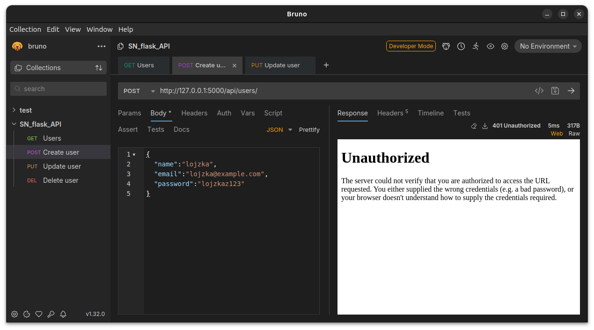
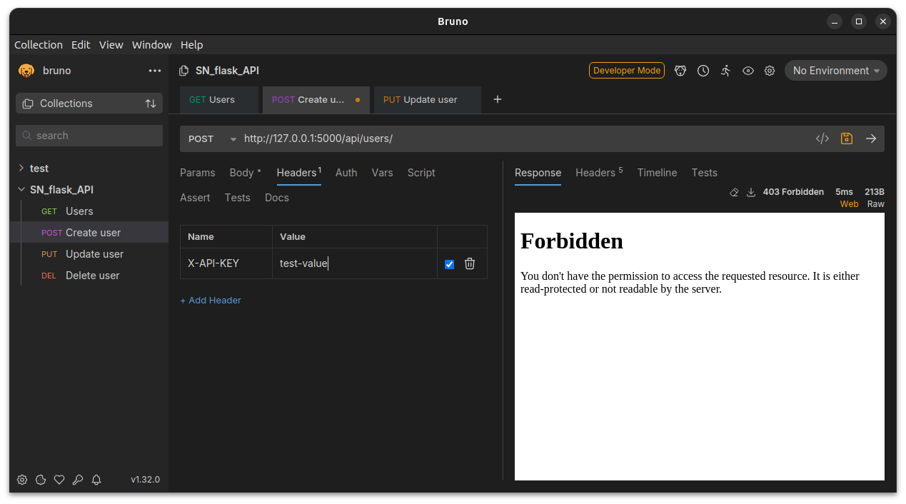
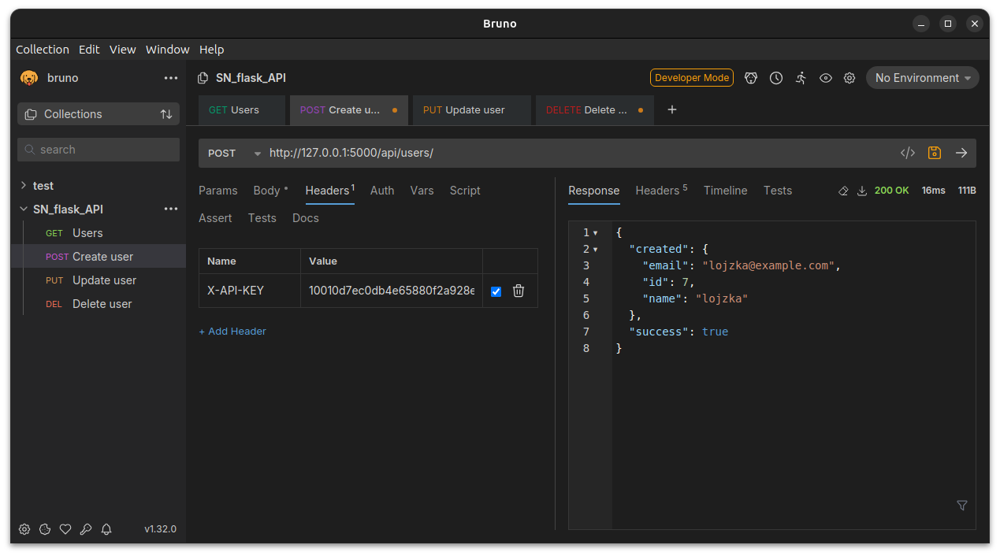

# Lesson 03 - API authentication

- stateful vs. stateless authentication
- REST should be stateless

## Types of API authentication

There are several ways to authenticate users and applications when accessing a REST API. Each method has its benefits and drawbacks, depending on factors such as security requirements, ease of implementation, and the specific use case. Here are some common authentication methods for REST APIs:

1. **HTTP Basic Authentication**:
   - **Benefits**: Simple to implement, built into HTTP protocol, no session management required.
   - **Drawbacks**: Credentials are sent in base64-encoded plaintext, susceptible to interception (unless used over HTTPS), no support for token expiration or revocation.
2. **HTTP Digest Authentication**:
   - **Benefits**: More secure than Basic Authentication as credentials are hashed, avoids sending plaintext passwords.
   - **Drawbacks**: Still vulnerable to replay attacks, more complex to implement, not widely supported in all clients and servers.
3. **API Keys**:
   - **Benefits**: Straightforward to implement, allows for tracking and limiting usage, no need for session management.
   - **Drawbacks**: Less secure than other methods if API keys are leaked or stolen, limited flexibility for user-specific access control.
4. **JSON Web Tokens (JWT)**:
   - **Benefits**: Stateless authentication, supports token expiration and revocation, allows for custom claims and fine-grained access control.
   - **Drawbacks**: Tokens can be large, requiring more bandwidth, token revocation can be challenging without centralized management, potential security vulnerabilities if tokens are not properly validated.
5. **OAuth 2.0**:
   - **Benefits**: Industry-standard protocol, supports delegated authorization, allows for granular access control, token-based authentication with refresh tokens.
   - **Drawbacks**: Complex to implement correctly, requires understanding of various grant types and security considerations, potential for misconfiguration leading to security vulnerabilities.
   - **Info:** OAuth also uses JWT for it's functionality
6. **OpenID Connect**:
   - **Benefits**: Built on top of OAuth 2.0, adds identity layer, supports authentication with third-party identity providers (IdPs), facilitates Single Sign-On (SSO).
   - **Drawbacks**: Similar complexity to OAuth 2.0, requires integration with an identity provider, potential for misconfiguration or security vulnerabilities.

Each authentication method offers different trade-offs in terms of security, ease of implementation, and flexibility. The choice of authentication mechanism depends on factors such as the sensitivity of the data being accessed, the level of trust between the client and server, and the specific requirements of the application. It's important to carefully evaluate the strengths and weaknesses of each method and choose the one that best aligns with the security and usability goals of the API.


## Create authentication with API key

First create a list of API keys in a **config.py** file.

```python
API_KEYS = [
    '10010d7ec0db4e65880f2a928ed41d42',
    'ceea17a17a114a0aa61b79607a46433f',
    'bdd54f37d3d44f4bb396863409d95483',
    'ac5538209efe493ba2be13cc180be933',
    '48143a8499a948fc949338df156fb62b',
    '0c4f4c1e617b4f26b3e1be8f3581c04f',
    'fa0a0ecafcac45eb8518efd8798ee5a1',
    'bfb4cd8cb78e444f98beb5f80eedaf51',
    '81f340ed08d94305b7a3abe0191630d2',
    '792367be620446aca4a3a80184348331',
]
```

This would usually be generated on request and be saved in the database, connected to a user. The keys in the database can be further protected through hashing them (with salt). This is a good practice and should be followed, but is not as important as hashing users' passwords since users often reuse their passwords and API keys are generated randomly.

Then, create an **authentication.py** file with the following code:

```python
from flask import request, abort
from config import API_KEYS

def require_api_key():
    key = request.headers.get('X-API-KEY')

    if not key:
        abort(401)
    if key not in API_KEYS:
        abort(403)
```

In this file we're checking that the request and we're aborting - responding with an Error code when the `X_API_KEY` header does not exist, or that when it's value is not among API_KEYS.

**What are some other ways of sending the API key?** 

Api key can be sent in a header, like we did in our example above. The header's name is `X_API_KEY`. We could also send this key in a HTTP header with a different name, but this one is commonly used.

Some APIs (such as OpenWeatherMap) expect the API **key as an URL parameter**. This is also possible, but it's not the best practice. Figure out why.

**Using this authentication architecture.**

To use this authentication scheme we need to add the call to `require_api_key()` function at the beginning of every controller that we want to protect with authentication. For example in **blueprints/api.py**:

```diff
 from flask import Blueprint, jsonify, abort, request
 from models import get_all_users, get_user, add_user, update_user, delete_user
+from auth import require_api_key
 
 api = Blueprint('api', __name__)
 
@@ -22,6 +23,7 @@ def show(user_id):
 
 @api.route('/users/', methods=['POST'])
 def store():
+    require_api_key()
     body = request.get_json()
     name = body.get('name', None)
     email = body.get('email', None)
```

### Test the protected API endpoint

We can now test our newly protected API endpoint. In API testing software (such as Postman or Bruno) we try to send a request with no change



When we add the correct header with the wrong value, we get a **403 Forbidden** HTTP error



But wen we also provide the correct value for the token, we get a successful response.



### Refactor the code - use decorators

The fact that we need to call`require_api_key()` function inside each of the controllers that we want to protect is not ideal - this is not the primary business logic of a controller. We could use decorators to annotate the controllers that we want to protect.

Change the **auth.py** to the following:

```python
from flask import request, abort
from config import API_KEYS
import functools

def require_api_key(func):  

    @functools.wraps(func)
    def wrapper(*args, **kwargs):
        key = request.headers.get('X-API-KEY')

        if not key:
            abort(401)
        if key not in API_KEYS:
            abort(403)

        return func(*args, **kwargs)
    
    return wrapper
```

Decorators are a functions that take a base function as an argument and can change it's behavior. With this we can, for example, check the headers for authentication headers before we process the request.

## Authorization

Authorization in software development refers to the process of determining what actions or resources a user is allowed to access within a system. After a user is authenticated (their identity is verified), authorization checks their permissions based on predefined roles or rules. This ensures that users can only perform tasks or access data that they are permitted to, such as viewing, editing, or deleting certain information. Authorization helps maintain security and control in applications by restricting access to sensitive features or resources.

**Add a simple Authorization logic.**

For each API key, add a set of permissions. In **config.py** let's change

```python
class Permission:
    USERS_READ = 1
    USERS_CREATE = 2
    USERS_MANAGE = 3

MAX_SECRET = 30
API_KEYS = {
    '10010d7ec0db4e65880f2a928ed41d42':[ Permission.USERS_READ, Permission.USERS_CREATE, Permission.USERS_MANAGE ],
    'ceea17a17a114a0aa61b79607a46433f':[ Permission.USERS_READ, Permission.USERS_CREATE, Permission.USERS_MANAGE ],
    'bdd54f37d3d44f4bb396863409d95483':[ Permission.USERS_READ, Permission.USERS_CREATE, Permission.USERS_MANAGE ],
    'ac5538209efe493ba2be13cc180be933':[ Permission.USERS_READ, Permission.USERS_CREATE ],
    '48143a8499a948fc949338df156fb62b':[ Permission.USERS_CREATE ],
    '0c4f4c1e617b4f26b3e1be8f3581c04f':[ Permission.USERS_READ, Permission.USERS_CREATE ],
    'fa0a0ecafcac45eb8518efd8798ee5a1':[ Permission.USERS_READ ],
    'bfb4cd8cb78e444f98beb5f80eedaf51':[ Permission.USERS_READ ],
    '81f340ed08d94305b7a3abe0191630d2':[ Permission.USERS_READ ],
    '792367be620446aca4a3a80184348331':[ Permission.USERS_READ ],
}
```

We've created a `Permissions` class to use the attributes as constants in our code.

In the **auth.py** we can now add another decorator. This one is more complex since it needs to take parameters.

```python
def get_api_key_or_abort():
    key = request.headers.get('X-API-KEY')

    if not key:
        abort(401)
    if key not in API_KEYS:
        abort(403)

    return key


def require_permission(permission):
    def decorator(f):
        @functools.wraps(f)
        def decorated_function(*args, **kwargs):
            key = get_api_key_or_abort()

            if permission not in API_KEYS[key]:
                abort(403)
            return f(*args, **kwargs)

        return decorated_function
    
    return decorator
```

and with `get_api_key_or_abort()` we can also refactor `require_api_key()` decorator:

```diff
 def require_api_key(func):
 
     @functools.wraps(func)
     def wrapper_requiere_api_key(*args, **kwargs):
-        key = request.headers.get('X-API-KEY')
-
-        if not key:
-            abort(401)
-        if key not in API_KEYS:
-            abort(403)
+        get_api_key_or_abort()
 
         return func()
 
     return wrapper_requiere_api_key
```

Now we can require permissions for a specific API endpoint in **blueprints/api.py**:

```diff
 from flask import Blueprint, jsonify, abort, request
 from models import get_all_users, get_user, add_user, update_user, delete_user
-from auth import require_api_key
+from auth import require_api_key, require_permission
+from config import Permission
 
 api = Blueprint('api', __name__)
 
 @api.route('/users/', methods=['POST'])
 @require_api_key
+@require_permission(Permission.USERS_CREATE)
+@require_permission(Permission.USERS_READ)
 def store():
     body = request.get_json()
     name = body.get('name', None)
 ...
```


## Homework

- Move te API keys to a new database table, generate new keys on user request and show them only to the user who created them.
  - for additional security you can show them to the user only once and save them hashed
- Read about JSON Web Token (JWT)

## See also

- [Decorators in Python](https://realpython.com/primer-on-python-decorators/)
- [Best practices for REST API security](https://stackoverflow.blog/2021/10/06/best-practices-for-authentication-and-authorization-for-rest-apis/)
- [JWT authenticatoin in Flask](https://www.freecodecamp.org/news/jwt-authentication-in-flask/)
