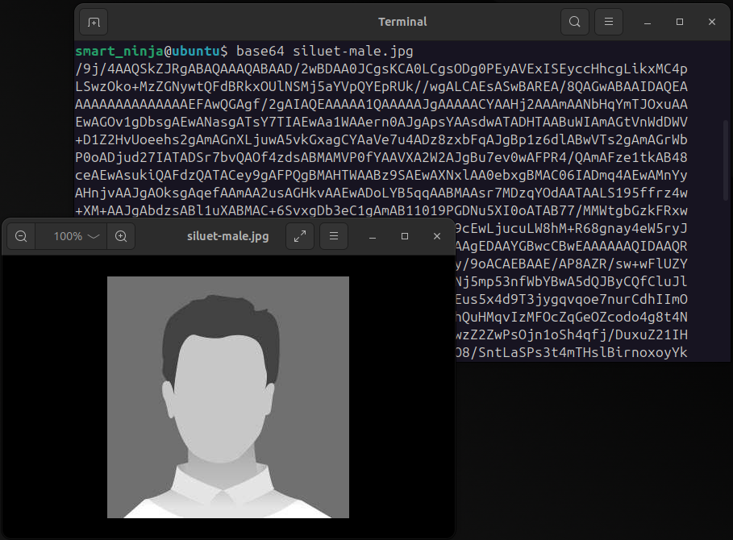
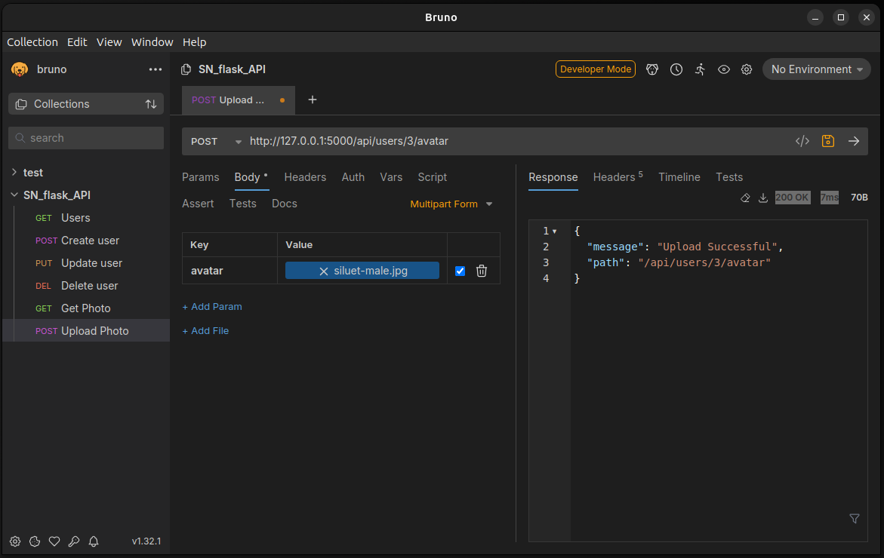

# Lesson 04 - File upload

Why: saving files from users for further processing

In the previous lessons we have have created an API through which we can access the information on the server in a secured way using authentication and authorization. As of now we have allowed only text-based data to be created and manipulated. In many situations that is sufficient and the vast majority of API calls include only JSON payload. There are some cases, however, where we need to be able to upload the binary data to our server.

The most obvious case for that is uploading files that the web application can then display, or use for further processing. These can be photos, videos, audio files, documents, archive files and similar.

In this lecture, we'll learn how we can make an API endpoint that accepts a file as it's payload. We will do some basic validations for this files to make sure that the uploaded file is not malicious and can not create issues on our infrastructure.

## Types of file transfer

### Base64 encoding

Base64 is an encoding scheme that converts binary data (like files) into an ASCII string representation, consisting of 64 characters: uppercase and lowercase letters, digits, plus (+), and forward-slash (/). This encoding ensures that binary data can be transmitted over protocols that only support text, like HTTP, by transforming the data into a string that doesn't introduce special characters or binary formatting issues. While it expands the data size by about 33%, Base64 is useful for making **binary data safe for text-based systems**.

Binary files can be transformed into base64-text with encoders that are developed in different programing languages and for different platforms. Below is an example of a Linux CLI base64 encoder used to encode an image.



When uploading a file to a server using a REST API, Base64 can be used to encode the file's binary content (e.g., an image or PDF) into a text format, which is then included in the API request (usually in JSON or XML format). For example, the client would read the file, encode it in Base64, and send it as part of the request body under a designated field. On the server, the encoded data is decoded back into its original binary form and stored. This method is commonly used when a simple API doesn't support direct binary file uploads via `multipart/form-data`.

### Sending the file with form-data mime type

As we've mentioned, when encoding the file with Base64 algorithm, the file size increases by about 33%. This leads to larger payloads, slower transmission, and higher memory usage on both the client and server. This inefficiency can cause performance issues, especially with large files or on limited bandwidth. Additionally, Base64 requires extra processing to encode and decode the data, adding further overhead.

For situations where we expect files of non-trivial size, uploading them with Base64-encoded strings is not sensible. In these cases we'll be using a `multipart/form-data` mime type.

Let's create a simple example to show how this kind of request is received on the server side and how we can test that API.

## Create a simple file-upload endpoint

We'll add another endpoint to our API. It's purpose will be to save the users' avatar on our server.

First let's define where in our file system we'll be saving the file. This configuration can be set as a constant in **config.py**

```python
UPLOAD_FOLDER = './upload'
```

We'll be using this setting in the API code, so let's import it there. We'll also create the controller function the **api.py** file:

```python
@api.route('/users/<user_id>/avatar', methods=['POST'])
def avatar_crete(user_id):
    if 'avatar' not in request.files:
        return jsonify({
            'error': 'expected \'avatar\' field'
        }), 422
    
    file = request.files['avatar']
    filename = file.filename

    file.save(os.path.join(UPLOAD_FOLDER, filename))

    return jsonify({
        'message': 'Upload Successful',
        'path': url_for('api.avatar_show', user_id=user_id)
    })

```

In the first line of the controller, we check if the `'avatar'` field is present in the request and return a JSON error response with HTTP response code if that's missing.

Then, we assign the file to a variable and get it's file name. This is the name of the file as the user uploaded it. With `file.save()` method, we'll save the file to the upload folder previously set in the configurations. We're using `os.path.join` method for joining path so that we can prevent some common errors in path concatenation.

We can create a request using Bruno (or Postman). We choose the correct method - `POST`, and in the Body select the correct mime type: **Multipart Form**. Then we can add a file parameter, set the key to "avatar" and for the value we select a test file.



Upon the request, the new file is created on the server.

### Adding some security

There are several different flaws with our implementation. The file name is left for the user to decide which means that they can fabricate a malicious filename that could break our system. Additionaly we're allowing any kind of file to be saved to our hard drive which can also pose a thread.

Let's fix this issues by adding some validations and checks.

```python
def allowed_type(filename):
    print(filename)
    ALOWED_TYPES = ['jpg', 'jpeg', 'png', 'gif', 'webb']
    return  '.' in filename  and \
        filename.rsplit('.', 1)[1].lower() in ALOWED_TYPES

def protect_filename(filename):
    sufix = filename.rsplit('.', 1)[1].lower()
    return str(uuid.uuid4()) + '.' + sufix
```

The `allowed_type` function is a naive validation for the file type. It really just checks for the filename's extension which is not a reliable way of doing that. In a real-world application, we would want to confirm that the file type is actually what it claims it is by the extension. One possible way we could do that would be using the `python-magic` or `filetype` python libraries. We will however simplify so we don't need to install additional packages.

The second function serves renaming the filename. It is a good practice that we append a random-generated string to the file that we're saving or rename it completely. The purpose of this is to minimize the likelihood of different files 'colliding' under the same name.

Let's use these functions in our controller.

```python
@api.route('/users/<user_id>/avatar', methods=['POST'])
def avatar_crete(user_id):
    if 'avatar' not in request.files:
        return jsonify({
            'error': 'expected \'avatar\' field'
        }), 422
    
    file = request.files['avatar']

    if not allowed_type(filename=file.filename):
        abort(422)
    
    filename = protect_filename(file.filename)

    file.save(os.path.join(UPLOAD_FOLDER, filename))

    return jsonify({
        'message': 'Upload Successful',
        'path': url_for('api.avatar_show', user_id=user_id)
    })
```

### Save the photo's path to the user

With this we have created an API endpoint whit which we can more-or-less securely save a file to our server. The file is in the `uploads/` folder and it's name is a random string of characters. We haven't yet connected the file to the user that uploaded the photo. Let's do that now.

**Change the user model**

To save the name of the file to the database, we'll need to change the database schema. Add a new class attribute in the `User` class. That will create a new column in the database.

```python
class User(db.Model):
    id = mapped_column(Integer, primary_key=True)
    name = mapped_column(String, unique=True, nullable=False)
    email = mapped_column(String, unique=True)
    secret_number = mapped_column(Integer)
    passwd = mapped_column(String(40))
    session_token = mapped_column(String(40))
    avatar_path = mapped_column(String, unique=True)
    #...
```

We'll also need to update the `update_user` method to be able to save the avatar data to the db. The new function looks like this:

```python
def update_user(id:int, email=None, name=None, password=None, avatar=None):
    user = get_user(id=id)
    if not user:
        abort(404)
    if email and email != '':
        user.email = email
    if name and name != '':
        user.name = name
    if password and password != '':
        user.password = hashlib.sha256(password.encode()).hexdigest()
    if avatar and avatar != '':
        user.avatar_path = avatar

    db.session.add(user)
    db.session.commit()

    return user
```

Now we can call the `update_user` method after we save the file to the disc.

```python
def avatar_crete(user_id):
	
	# ... other logic before
	
    file.save(os.path.join(UPLOAD_FOLDER, filename))
    update_user(user_id, avatar_file=filename)

    return jsonify({
        'message': 'Upload Successful',
        'path': url_for('api.avatar_show', user_id=user_id)
    })
```

## Homework

We have created an endpoint to save the file to the server. Create another endpoint that returns this file. Check the `send_from_directory` method in `Flask` package. Make sure you send the image of the correct user back.
