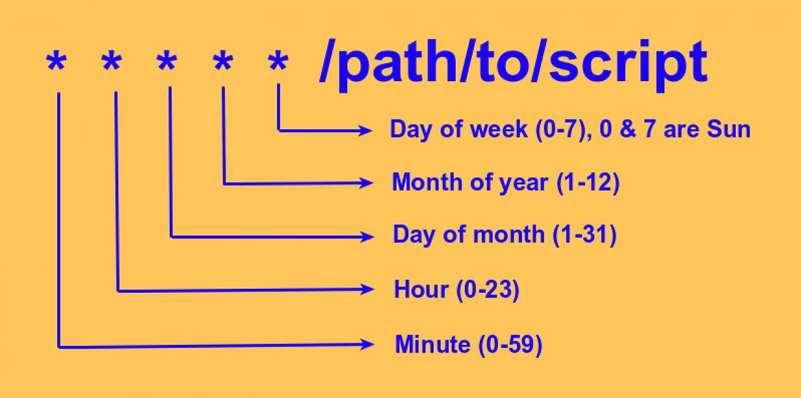

# Lesson 05 - Back-end processing and cron

Why: Learn about scheduled jobs that run regularly, outside of a request cycle


## What are cron jobs and how do they work

Cron jobs are commands or scripts that are scheduled to run periodically at fixed times, dates, or intervals. They're usually ran using the cron scheduling utility in Unix-like operating systems. The term "cron" comes from the word "chronos," which means time in Greek.

Here's how cron jobs work:

1. **Cron Tab**: The cron utility uses a configuration file called the "cron tab" to schedule jobs. Each user on a Unix-like system can have their own cron tab, which contains entries specifying commands or scripts to be executed and the schedule at which they should run.
2. **Cron Schedule**: The schedule for a cron job is specified using a cron expression, which consists of five fields representing minute, hour, day of the month, month, and day of the week. Each field can contain a single value, a list of values separated by commas, a range of values, or special characters to represent all possible values.
3. **Execution**: The cron daemon, a background process that runs continuously, checks the cron tab periodically to determine if any scheduled jobs need to be executed. If a job's schedule matches the current time, the cron daemon invokes the specified command or script to run the job.
4. **Output**: The output generated by a cron job, such as error messages or program output, is typically sent via email to the user who owns the cron tab. Alternatively, the output can be redirected to a file.


## Cron unix utiliy

1. **Log into Linux**: Use SSH to connect to your Linux server.
2. **Edit the Cron Tab**: Open the cron tab using the command `crontab -e`.
3. **Add a Cron Job**: Enter the schedule and command/script you want to run. Example:

```
0 0 * * * /path/to/my_script.py
```

4. **Save and Exit**: Save the changes and exit the text editor (e.g., `:wq` in Vi or `Ctrl + O`, `Ctrl + X` in Nano).

5. **Verify**: Check the added cron job with `crontab -l`.



## Examples of cron tasks

1. **System Maintenance**:

   Running cleanup scripts to remove temporary files, logs, or outdated cache files on a daily or weekly basis. Regular system maintenance helps keep the server running smoothly by freeing up disk space and optimizing performance.

2. **Data Backups**:

   Scheduling database backups every night at midnight to ensure that critical data is securely stored. Automated backups help prevent data loss in the event of hardware failures, human error, or security breaches.

3. **Scheduled Updates in Web Development**:

   Automatically fetching and updating content from external sources, such as news feeds or social media APIs, every hour. Scheduled updates ensure that web content remains fresh and relevant without manual intervention.

4. **Server Administration**:

   Periodically checking for and applying operating system updates or security patches on a weekly basis. Regularly updating the server's software helps protect against security vulnerabilities and ensures system stability.

Cron jobs provide a reliable and efficient way to automate these routine tasks, reducing the need for manual intervention and freeing up developers' time to focus on more critical aspects of web development and server management.


In web development, we often use cron jobs for tasks that take a long time to finish. When you visit a webpage, it should load quickly, ideally within a second or two. But sometimes, we need to do heavy work on the server that can't be done that fast. In these cases, instead of making you wait, we quickly save the necessary information, show you something on the webpage, and then do the heavy work in the background using a cron job.

Some examples of these tasks are:

- **Generating Reports or Aggregating Data**:
  - **Example**: A sales dashboard application needs to generate daily sales reports.
  - **Implementation**: The application quickly saves daily sales data to a database. Later, a cron job runs nightly to aggregate this data and generate a comprehensive sales report for management to review.
- **Fetching Information from an API**:
  - **Example**: A weather forecast application needs to fetch weather data from a third-party API.
  - **Implementation**: The application quickly saves user requests and responses to a database. Then, a cron job runs periodically to fetch updated weather data from the API and store it in the database for future use.
- **Scraping Web Pages**:
  - **Example**: A price comparison website needs to scrape product prices from various online retailers.
  - **Implementation**: The website quickly saves the URLs of product pages to a database. Later, a cron job runs periodically to visit these URLs, scrape the product prices, and update the database with the latest pricing information.
- **Processing Images, Audio, or Video Files**:
  - **Example**: A social media platform allows users to upload images for profile pictures.
  - **Implementation**: Upon user upload, the platform quickly saves the images to storage. Then, a cron job runs periodically to process these images, such as resizing them to fit various display sizes, and updates the user profiles accordingly.
- **Generating Assets**:
  - **Example**: A web application needs to generate thumbnails for videos uploaded by users.
  - **Implementation**: Upon video upload, the application quickly saves the video files to storage. Later, a cron job runs periodically to generate thumbnails for these videos, improving the user experience when browsing video content.
- **Computational-Intense Operations**:
  - **Example**: A scientific research website needs to perform complex calculations for data analysis.
  - **Implementation**: User requests trigger the submission of data for analysis, which is quickly saved to a queue. A cron job runs in the background, picking up tasks from the queue, performing the calculations, and storing the results for users to access later.

## Create CLI for Flask

Create a new file, called **scheduled.py** with a new function:

```python
import models
from config import UPLOAD_FOLDER, THUMB_FOLDER

def register_commands(app):

    @app.cli.command("process_imgs")
    def process_imgs():

        users = models.get_all_users()
        for user in users:
            if THUMB_FOLDER not in user.avatar_file:
                print(f'processing user: {user}')
                # here we should actually do the work
            else:
                print(f'skipping user {user}')

```

In the code above we've used a new configuration variable `THUMB_FOLDER`. This points to the folder where we'd like to save our cron-generated thumbnail images. Let's add this configuration in the `config.py`

```python
THUMB_FOLDER = './upload/thumbnails'
```

In **main.py** we have to import the function and call it to register the CLI commands.

```diff
 import hashlib
 import json
 from config import MAX_SECRET
 from blueprints import api
+from scheduled import register_commands
 
 app = Flask(__name__)
 
@@ -17,6 +18,7 @@ with app.app_context():
     db.create_all()
 
 app.register_blueprint(api.api, url_prefix='/api')
+register_commands(app)
 
 """
 a simple (bad) example for generating test users

```

With this we can call the function from the command line:

```bash
flask --app main.py process_images
```

### Add the cropping function

Let's add the functionality for cropping images. This is the working part of the program and it could be anything; image processing, backups, data aggregation ... We'll add this function in the `scheduled.py`, and call it in the line where we currently have a comment `# here we should actually do the work`. The internals of this function are not crucial, but it opens the image, cuts it in the pre-set dimensions and saves it in the different location.

```python
from os import path
from PIL import Image

def create_thumbnail(user, app):

    image = Image.open(path.join(app.root_path, UPLOAD_FOLDER, user.avatar_file))
    left = 40
    top = 0
    right = 460
    bottom = 350
    print('cropping ...')
    cropped_img = image.crop((left, top, right, bottom))

    print('saving ...')
    thumbnail_path = path.join(THUMB_FOLDER, user.avatar_file)
    cropped_img.save(path.join(app.root_path, thumbnail_path))

    models.update_user(id=user.id, avatar_file=thumbnail_path)
```

In the line where we're opening we're opening the image, we're using an absolute path with the `app.root_path`. We need to do this so we can run it with external program such as Cron.

Additionally, we're using `PIL` library for cropping the image. To be able to use this library, we need to add it to requirements and install it via pip. Add the following line to `requrements.txt`:

```
Pillow==12.0.0
```

and then run `pip install -r requirements.txt`. Pillow is a replacement package for a deprecated and now unmaintained PIP library. The import code stayed the same for backwards compatibility reasons.

## Configure Cron

Add a **crontab entry** with crontab -e

```
0 * * * * /home/matej/sn_lesson05_code/.venv/bin/python /home/matej/sn_lesson05_code/.venv/bin/flask --app=/home/matej/sn_lesson05_code/main.py process_imgs > /tmp/sn_cron_log.txt 2>&1
```

When we save the file, the processing of the images will start on the first minute of every hour, every day in the year.

## How do we solve this problems in real-world python applications

In this lesson we've learned about the idea of scheduled jobs and how to implement them with cron. Through this we learned how cron itself works, how do we configure it, in which cases we use scheduled jobs, etc. We've also seen how can we register a command in a flask application that we can then start through a CLI. This can come in handy for many other purposes than only triggering a scheduled job via cron.

In fact, in large scale real-world Python applications, we don't run schedule jobs simplya through cron. We use a task queue library like **Celery**. This approach offers us much more flexibility and power and provides us with functionalities like retry on failure, parallel workers, rate limiting, task monitoring, distributed execution ets. It does, however bring in additional overhead and complexity of another library and a message broker service. It still needs to be triggered which can be done through *Celery beat* or again with a cron job.

You can read about Celery in it's [documentation](https://docs.celeryq.dev/en/latest/getting-started/first-steps-with-celery.html) or read about how to deploy a [Flask app with a background worker](https://render.com/docs/deploy-celery) on Render (that we used in WD1).

### Cron vs. workers

We learned about cron jobs because they are simpler to set up and understand and since they are language independent, they can be used in many different use cases. In a Flask context they are useful when we need to run tasks on a fixed schedule, when the task's logic is relatively simple and predictable, and when we wont to avoid infrastructure overhead. They can reliably be used for (nightly) batch jobs, cleanup tasks, backups or periodic metrics aggregation.

Workers on the other hand should be used when tasks are triggered by user actions, they're slow and/or unpredictable, we need retries, progress, or status visibility and when we expect the these tasks to be growing a lot when the application scales up.

## Homework

- create a script that does the clean-up of the upload folder and run that script with cron
- change the cropping script such that it crops out the face only
  - additionaly it can cut it as a circle