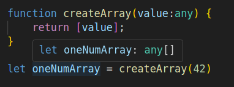
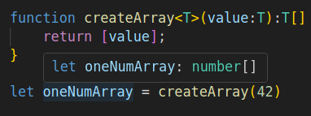

# Lesson 12 - TypeScript

TypeScript is a **superset of JavaScript** that adds **static typing** and additional features to improve code quality and maintainability. It compiles down to standard JavaScript, meaning it can run anywhere JavaScript does—browsers, Node.js, or other JavaScript environments.

## Short history

TypeScript was developed by **Microsoft** and first released in **2012**. The main goal was to address JavaScript's weaknesses in large-scale applications, particularly **lack of type safety, poor tooling support, and maintainability issues** in big projects. By adding a static type system, TypeScript helps developers catch errors early and makes it easier to manage complex codebases.

### **What Problems Does TypeScript Solve?**

Unlike JavaScript, which is **dynamically typed**, TypeScript enforces **strict types** at compile time. This prevents **common errors** like:

- Passing the wrong type of argument to a function
- Accessing non-existent object properties
- Silent runtime errors that only appear when the code executes

TypeScript also improves **developer experience** by providing **better auto completion, refactoring tools, and self-documenting code**, making it easier to scale and maintain large applications.

TypeScript, however does NOT solve all the problems you might face when developing for JavaScript environments:

- It does NOT make code run faster
  TS compiles to JavaScript - the code that's being rung will still be JavaScript so the end program can in the best case have the same runtime performance as JS
- It does NOT eliminate **runtime errors**
  There are some types of errors that TypeScript can not predict. These are called runtime errors because they happen when the program is being run (as JS) instead of when/before TS gets compiled to JS. These errors typically happen due to **unexpected conditions**, such as invalid user input, missing files, network failures, or logic bugs that only appear when the program runs. TS can not help with solving these errors.
- It does NOT replace **the need for good tests**
  As we'll see later on, tests are still important. Unit, integration and end-to-end tests serve a different purpose - testing errors in application logic. Using TypeScript alone does not negate the need for comprehensive codebase testing.
- Not always necessary
  When working on a small project - TS might not be needed. However if a project grows to a considerable size it makes it easier to manage if it is written in TS. Depending on what kind of project are you building, you can opt not to use TS since there are some drawbacks of TS:
  - Typescript gets compiled to Javascript - this step takes some setting up and some time when being compiled.
  - Typescript gives some overhead when coding. Even though many editors make coding with TS faster because of better code completion, there is some overhead when writing TS code.

### **How is TypeScript Used?**

To use TypeScript, developers install it via npm (`npm install -g typescript`), write `.ts` files instead of `.js`, and compile them using the TypeScript compiler (`tsc`). TypeScript can be integrated with frameworks like **React, Angular, and Node.js**, making it a popular choice for modern web development.

Let's see an example.

## Try typescript

### Installing TypeScript Globally

The following command installs TypeScript compiler globally which allows you to use the `tsc` command anywhere in your system:

```sh
npm install -g typescript
```

- The `-g` flag means **global installation**, making `tsc` available across all projects.
- You can check if TypeScript is installed by running `tsc --version`. This should output a version number (e.g., `Version 5.1.3`)

### Initializing a TypeScript Project

Once TypeScript is installed, you need to configure it by creating a `tsconfig.json` file. This file controls how TypeScript compiles your code.

Run: `tsc --init`.

This generates a `tsconfig.json` file with many configuration options. Some of them ones include the following:

```json
{
  "compilerOptions": {
    "target": "ES6",        // Output JavaScript version (ES5, ES6, ESNext)
    "module": "CommonJS",   // JavaScript module system (CommonJS for Node.js)
    "strict": true,         // Enables strict type checking
    "outDir": "./dist",     // Where compiled files are saved
    "rootDir": "./src",     // Where TypeScript files are located
    "removeComments": true, // make sure that the comments are removed when compiling to JS
    "noEmmitOnError": true, // don't compile if there's a TypeScript error
  }
}
```

Now, TypeScript will look inside the `src/` folder for `.ts` files and output JavaScript files into the `dist/` folder. For more configuration you can check the [TS documentation](https://www.typescriptlang.org/docs/handbook/tsconfig-json.html).

### Writing TypeScript Code

Now, let's create a new TypeScript file inside the `src/` folder. Name it `index.ts` and write some TypeScript code:

```ts
// Function that takes a string argument and returns a string
function greet(name: string): string {
  return `Hello, ${name}!`;
}

// Call the function and print the result
console.log(greet("Alice"));
```

How This Code Differs from JavaScript:

- We explicitly declare that `name` is a **string** (`name: string`).
- We specify that the function **returns a string** (`: string`).
- TypeScript will prevent passing non-string values (`greet(42)` would cause a compile error).

### Compiling TypeScript to JavaScript

To run this TypeScript code, we first need to **convert it into JavaScript**, since browsers and Node.js do not understand TypeScript directly.

Run: `tsc`. If `tsconfig.json` is set up correctly, TypeScript will **find all `.ts` files in the `src/` directory** and compile them into `.js` files inside the `dist/` directory.

If you don’t have a `tsconfig.json` (if you ran `tsc --init`, you should), you can still compile a single file manually with: `tsc index.ts`. This will generate `index.js`  in the same directory. 

The generated `dist/index.js` file will look like this:

```js
function greet(name) {
  return "Hello, " + name + "!";
}
console.log(greet("Alice"));
```

- Notice that **all TypeScript-specific features (like type annotations) are removed** in the JavaScript output.
- This ensures compatibility with any JavaScript environment.

#### Automating Compilation

Instead of running `tsc` manually every time you change the code, you can use **watch mode**:

```sh
tsc --watch
```

- This will **automatically recompile** the TypeScript files whenever you save changes.
- The output JavaScript files will be updated in real-time.

Try compiling some ES6 code. Add the following code to `/src/index.ts` and compile it.

```javascript
let words = ['hello', 'world'];
console.log(['new', ...words]);
```

Check the results. Why is there so much code when it gets compiled?

### Running the Compiled JavaScript Code

Now, run the compiled JavaScript file using Node.js:

```sh
node dist/index.js
```

This should output:

```
Hello, Alice!
```


## TS types

### Primitive types

These are the basic data types available in JavaScript, enhanced with TypeScript’s type safety.

**string**
Example: `let name: string = "Alice";`
Represents text values.

**number**
Example: `let age: number = 25;`
Supports integers and floating-point numbers.

**boolean**
Example: `let isActive: boolean = true;`
Represents `true` or `false` values.

**bigint**
Example: `let bigNum: bigint = 12345678901234567890n;` 
Used for very large numbers.

**symbol**
Example: `let sym: symbol = Symbol("id");`
Represents unique identifiers.

**null**
Example: `let empty: null = null;`
Represents an explicitly empty value.

**undefined**
Example: `let notAssigned: undefined = undefined;`
Represents a variable that has not been assigned a value.

### Special Types

**any**
Example: `let value: any = "hello"; value = 42;`
If variable is not initialized, it's type is inferred to be `any`. This kind of variable type can be changed as a normal JS variable.

**unknown**
Example: `let input: unknown;`
Similar to `any`, but safer as it requires type checks before usage.

**never**
Example: `function error(): never { throw new Error("Error!"); }` 
Represents a function that never returns (e.g., infinite loops or thrown errors).

**void**
Example: `function logMessage(): void { console.log("Hello"); }`
Used when a function does not return a value.

### Complex Types (Reference Types)

**Tuple**

```typescript
let coordinate: [number, number]

coordinate = [42.3, 15.2]  //ok
cooridnate = ['Ljubljana', 'Slovenia']; // not ok
```

**Arrays**

JavaScript allows mixed arrays

```javascript
let nums = [1,2,'3']
```

This could cause issues when a part of a program would be expecting number types only so often we want to avoid this. TypeScript can help us with that:

```typescript
let nums: number[] = [1,2,3]
```

The alternative syntax for this is using Generics. We'll talk about generics at the end of this lesson.

```typescript
let strings: Array<string> = ["a", "b", "c"]; // Alternative syntax
```

Remember this, we'll refer to it later on.

**Objects**

```typescript
let person: {
    readonly id: number,
    name: string,
    print: (id: number) => void
} = {
	id: 123,
    name: 'Janez',
    print: (id:number) => console.log('name')
}

person.id = 122; //error
```

- note the `readonly` on a certain properties

### Custom types

Here it's an example of a complex object that we can annotate in TypeScript.

```typescript
type Person =  {
    readonly id: number,
    name: string,
    print: (id: number) => void
}
```

With that we can use a `Person` type as any other complex type.

We can use **Union operator** `|` to create a more complex type:

```typescript
functoin kmToNm(distance: number | string){
	if( typeof distance === 'number' ){
		return distance / 1.8
	} else {
		returnt parseInt(distance) / 1.8
	}
}

kmToNm(18)
kmToNm('18km')
```


**Enums**

A list of related constants

```typescript
enum Seasons { // PascalCase naming convention
	Spring = 0,
	Summer,
	Fall,
	Winter
}

let favoruteSeason:Seasons = Seasons.Spring
```

### Funcions

```typescript
function throwDice(max: number): number { // add explicit return type
    let x ='test';
	if(max > 0){
        return Math.ceil(Math.rand() * max);
    }
}
```

There are several TS configurations that you can set to make the code parsing more strict. You can use `noUnusedParameters` to prohibit unused parameters on functions, use `noImplicitReturns` to catch edge cases on functions that don't return, or use `noUnusedLocals` to catch unused variables.

If you wanna make a parameter optional  you can do so by adding a `?` on parameter like `throwDice(max: numbe, min?:number)` or default value `throwDice(max: numbe, min = 0)`.

If a function does NOT  return a value use return type `void`.

### Generics

How would you type-annotate a function that takes a parameter of any type and returns a single-element array of this same type:

```javascript
function createArray(value) {
    return [value];
}

let oneNumberArr = createArray(42);
```

The type annotation should get transfered to return value



In the example above, we would want to see the `oneNumArray` to be annotated with the `number[]` type since the parameter to the function is a number (42).

Use **generics**. Generic functions work with multiple types while keeping type safety.

```typescript

function createArray<T>(value:T):T[] {
    return [value];
}

let oneNumArray = createArray(42)
```

	

Another example with generics is as follows:

```typescript
function getFirstElement<T>(arr: T[]): T {
  return arr[0];
}

let firstString = getFirstElement<string>(["apple", "banana"]);
let firstNumber = getFirstElement<number>([10, 20, 30]);
```

In this case, variables `firstString` and `firstNumber` have well defined types.
